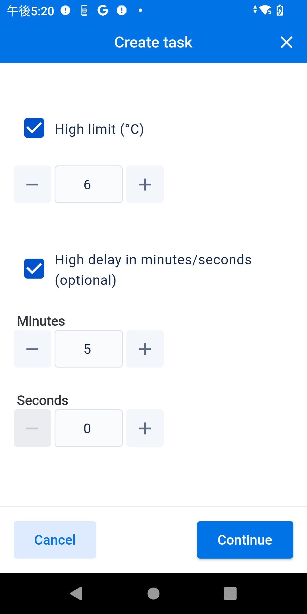
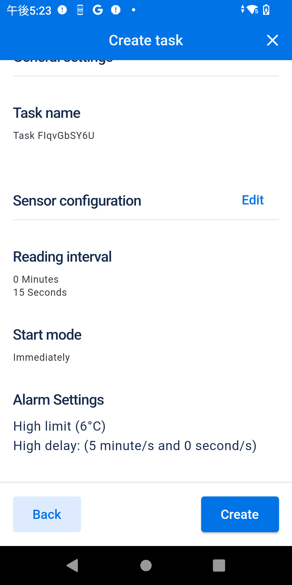
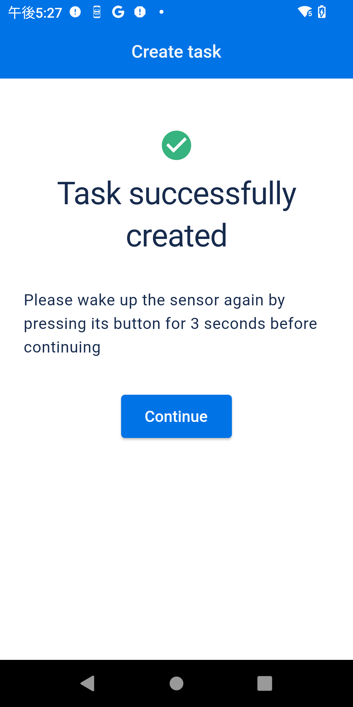
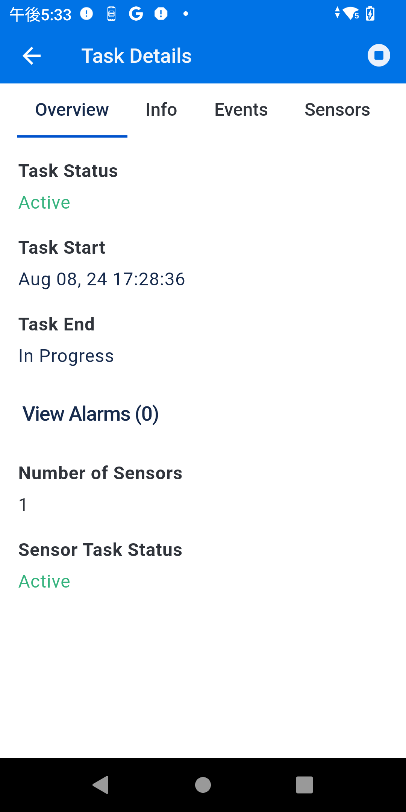
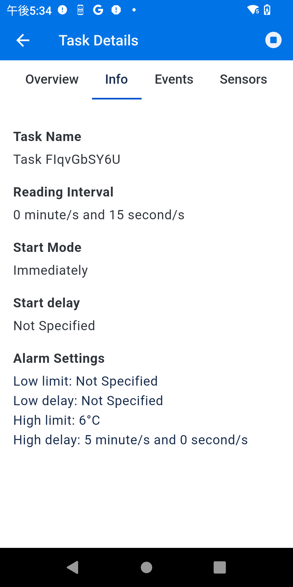
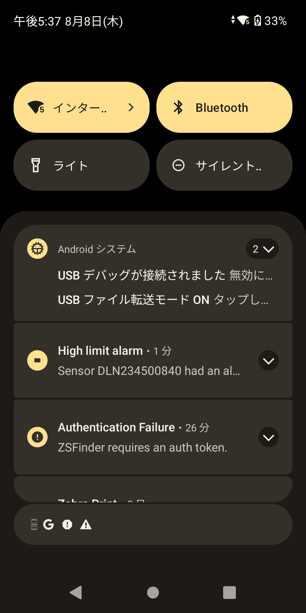
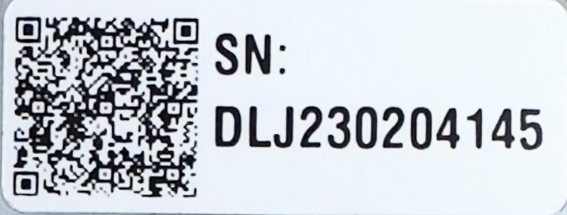
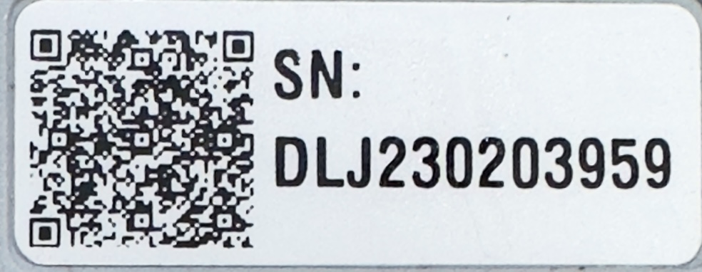

# Zebra電子温度センサー デモ方法（ZSDemo編）

### 参考情報

| Product            | Version                                                                                                                                                                                    |
| ------------------ | ------------------------------------------------------------------------------------------------------------------------------------------------------------------------------------------ |
| APK                | [ZSDemo - Google Play](https://play.google.com/store/apps/details?id=com.zebra.zsdemo)  [ZSFinder - Google Play](https://play.google.com/store/apps/details?id=com.zebra.zsfinder&hl=en_US) |
| ZSDemoの使い方     | [Youtube](https://www.youtube.com/watch?v=SpthDtwNBvs)                                                                                                                                        |
| サンプルコード     | [Git-Hub](https://github.com/ZebraDevs/Electronic_Temperature_Sensors-ZSDemo)                                                                                                                 |
| ソリューション概要 | [Youtube](https://github.com/ZebraDevs/Electronic_Temperature_Sensors-ZSDemo)                                                                                                                 |
| ドキュメント類     | [Zebra ZS300 Support - Documentation](https://www.zebra.com/jp/ja/support-downloads/environmental-sensors/electronic-temperature-sensors-data-device-monitoring-tools/zs300-sensors.html#Tab-item-023c8005df-tab)               |

 

### ZSDemo とは？

ZS300の主機能、動作、使用感を理解することを目的として開発されたAndroidのデモソフト。Zebra Android端末以外での検証はされていないため、サードパーティ製端末を利用の際は注意。

 

### ZSDemo の主な機能

温度管理ソリューションで一般的に利用する機能を網羅しており、実際の運用現場での利用方法がイメージし易い作りになっている。

1. ZS300のQRコード読み取りによるペアリング
2. ZS300内のデータをZebra Cloudにアップロード
3. タスクの設定（温度閾値・インターバル・開始条件の設定など）
4. タスクの開始・終了
5. アラート通知の受信
6. Zebra Cloud内の温度履歴・イベント情報を参照
7. 履歴情報（CSV)の取得
8. ZS300のバッテリ状態・情報を参照
9. ZS300の初期化

 

### デモに必要な機器

1. Zebra Android端末（A11以上）。

   - Internet 接続ができること
   - Bluetooth 接続がON になっていること
   - カメラ機能がON になっていること
   - 下記アプリがインストールされていること。
     - [ZSDemo - Google Play](https://play.google.com/store/apps/details?id=com.zebra.zsdemo)
     - [ZSFinder - Google Play](https://play.google.com/store/apps/details?id=com.zebra.zsfinder&hl=en_US)
2. ZS300
3. ZB200 (ブリッジによるデータ送受信実施の場合は必要)

 

### デモ手順の流れ(タスクの作成とZCloudデータ参照)

下記は手順フローとなり、要点のみを記載している。
細かい手順は[デモ説明動画](https://www.youtube.com/watch?v=SpthDtwNBvs)にて確認すること。

1. ZSFinderを起動し、サービスが起動してることを確認する。
2. ZSDemoを起動し、カメラ機能を利用してZS300とペアリングする。
3. 初めて利用するZS300の場合、エンロール処理が必要。アプリ画面の指示に従って操作をすること。
4. [Create Task]でZS300に対して必要な設定をする。

   ##### 例

   インターバル15秒で6℃以上の状態が5分間継続した場合にエラーイベントを検知する設定

       
5. 正常にタスクが登録されたことを確認する。

   
6. 設定内容・アラート通知・温度履歴などを参照。

   

※ その他、色々な機能があるので、確認すること。

 

#### 簡易的にZebra Cloudのデータを参照したい場合は

データ参照目的として、下記ZS300のデータが公開されている。ZSDemoから参照が可能。

 

 

#### ZB200の設定方法について

ZB200の設定方法についてはUsers Guideを参照すること。

https://docs.zebra.com/content/tcm/us/en/solutions/intelligent-sensors/zb200ug/zb200-bridge-user-guide.html
